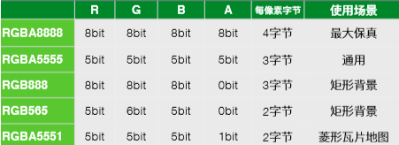
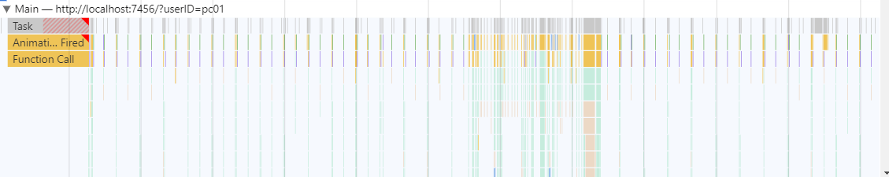

# **游戏开发之性能优化篇**

**版本：v1.0.0**

**作者：彭超**

**时间：2021年12月27日**

**修订：**

## 一、为什么要优化以及优化方向

对于游戏项目，经常会遇到一个问题，那就是：性能。

性能对我们至关重要，因为轻微的性能问题会导致用户的卡顿、游戏体验的变差，更大的性能问题将导致玩家无法进入游戏、运行时crash等严重后果。新进活跃、留存、支付、在线时长等运营数据背后的核心点是在于用户的体验，游戏性能是最能影响用户体验的因素之一。

然而，游戏性能是一个很复杂的话题。从产生原因来看，既会受到诸如包体大小（不合理的使用资源）、游戏逻辑（算法效率低下，堆内存泄漏）、后端服务稳定等因素影响，同时也受到玩家网络环境、机型设备等开发者无法控制的因素影响。

游戏的运行需要CPU和GPU共同参与，其中CPU主要负责逻辑代码运算，物理效果模拟和向GPU提交渲染指令（DrawCall），而GPU主要负责并行运算输出每一帧渲染画面。

无论是什么平台的游戏，对于性能的优化都可以从这几个方面入手：**CPU性能、GC性能、GPU渲染模块性能、物理模块性能、动画模块性能、UI模块性能、粒子模块性能、加载模块性能、内存占用、资源使用、代码执行效率**等。

### （一）游戏平台的性能优化方向

从游戏的运行周期来看，主要在启动和运行两个阶段会产生性能问题。

- 启动阶段：启动时长，该数据将显著影响用户打开留存率，启动耗时过长，等于直接拒绝了用户。
- 运行阶段：内存峰值、Crash率、CPU占用、流畅度、网络等。
- 其他兼容性问题，包括JS异常、黑屏、花屏等严重问题


因此对于游戏平台的性能优化主要从启动性能和运行性能两个方向着手。

## 二、游戏常用资源分类以及优化措施

### 	（一）游戏资源分类

游戏用到的常用资源分别为图片（Sprite、SpriteFrame、Texture、Image等），声音，动画（粒子、龙骨动画，Spine动画）、脚本，Json、预制件，场景等等，游戏资源的优化就可以从这些资源本身去出发。

#### 1.纹理资源

图像资源又经常被称作贴图、纹理以及图片等，是游戏中绝大部分图像渲染的数据源，游戏引擎中常见的图像资源格式有PNG、JPG等

##### （1）图像资源导致的性能问题

在内存的使用中， 图形内存（graphic memory）往往是游戏内存消耗大户，对于重度游戏我们发现图形渲染所使用的内存占比更大，因此优化图形内存对于整体内存使用率的降低是非常有必要的，图像资源对于性能的影响在于：内存的占用问题（过大内存可能会引发闪退crash）、渲染性能（例如，纹理带来的带宽压力）。

##### （2）图像资源的优化措施

通用的优化措施有：**纹理资源的压缩（Android使用ETC，iOS使用PVRTC）、使用图集（纹理资源的模块化）、合理使用纹理尺寸和格式、使用九宫切图**等。

##### （3）纹理资源优化方向

① 压缩纹理

可以使用TinyPNG、Pngquant 等第三方平台工具进行无损的格式压缩。

压缩的原理：主要是使用Quantization的技术，通过合并图片中相似的颜色，通过将 24 位的 PNG 图片压缩成小得多的 8 位色值的图片，并且去掉了图片中不必要的 metadata（元数据，从 Photoshop 等工具中导出的图片都会带有此类信息），这种方式几乎能完美支持原图片的透明度，有部分文档指出tinypng同时采用了pngquant、optipng、advpng几种脚本，图片的压缩率能达到50%以上，操作如下：


压缩前后对比：


压缩前后，图片的体积减少了**81%**，这对于提升效率是非常行之有效的方式。

**第二种纹理压缩方案**（推荐使用），就是根据不同平台采用不同的压缩格式。

**关于纹理压缩的介绍：**

纹理压缩是一种专为在计算机图形渲染系统中存储纹理而使用的图像压缩技术。 与普通图像压缩算法的不同之处在于，纹理压缩算法为纹素的随机存取做了优化。

传统的图片压缩主要目的是存储和传输，为了尽可能的高效压缩，使用了可变的压缩比率，因此在解压时需要解压更多的像素位才能读取某个像素的位置，不适合随机和快速读取，也发挥不了GPU的并行处理优势。

而压缩纹理使用一个固定的压缩比率，将纹理划分成多个像素块，每个像素块包含`2*2`或`4*4`个像素，然后对每个像素块进行压缩，被压缩的像素信息存储在一个像素集合中，每个像素块的索引位置存储在一个块索引图中。读取时，首先将纹理坐标转化为块索引值，然后在像素集合中查找对应的像素块，最后在这个像素块中找到纹理颜色值。

因为采用了固定的压缩比率，GPU内部可以并行处理，从而快速的解压缩。与之相对的是，纹理的压缩过程发生在程序运行之前，并不在意编码速度，因此在压缩时会遍历所有可能性，找到和原始像素差值最小的编码，这也是纹理压缩耗时较久的原因。

顺便说一下，普通图片格式中，PNG是无损压缩，JPEG是有损压缩。而压缩纹理都是**有损压缩**，只是在绝大部分情况下，手机上看不出来而已。

**压缩算法与性能**

Android设备中一般使用ETC1压缩，一种有损的图像压缩方式。

- ETC1是OpenGL2.0支持的标准，压缩之后每个像素占4bit，压缩之后的格式为KTX或者PKM，前者支持存储多纹理，后者只支持单纹理。 ETC1的缺点是不支持Alpha通道，不支持有透明度的图片压缩，另外，ETC1/ETC1+A纹理的长宽可以不相等，但要求是2的幂次方。

- ETC2是ETC1的扩展，压缩比率一样，但压缩质量更高，而且支持透明通道，能完整存储RGBA信息。
  ETC2需要OpenGL ES 3.0（对应WebGL 2.0）环境，目前还有不少低端Android手机不兼容，iOS方面从 iPhone5S 开始都支持OpenGL ES 3.0，ETC2和ETC1一样，长宽可以不相等，但要求是2的幂次方。

  

iOS设备中采用的图像格式一般是PVR，也是一种有损的图像压缩方式。PVR压缩分为两种，PVRTC2和PVRTC4。

- 除了压缩内存，PVR可以直接被显卡读取，载入速度更快；缺点是PVR需要PowerVR芯片支持，目前iOS设备都能完美支持，Android支持尚少。
- PVRTC4只支持方形贴图，非方形会被处理成方形，且长宽必须为2的幂，例如`1280*720`的PNG图片，转换后变成`2048*2048`，这一点会大大增加内存消耗。在实测中还发现转换后的图片质量不如ETC1，存在模糊、毛边现象，对画面要求高的游戏不适合。


ASTC压缩算法

ASTC压缩算法基于块压缩的思想，将纹理分为多个小块进行压缩。每个块可以有不同的压缩格式和压缩比，这样可以根据纹理的特性进行灵活的调整。压缩出来的文件后缀为.astc。通过使用ASTC算法，开发者可以减小纹理数据的大小，提高应用的性能和响应速度，同时节省存储空间和带宽。


总之， **KTX**、**PKM**、**PVR、ASTC**都是纹理存储的文件格式，受限于移动设备GPU的支持情况，建议采用astc的压缩格式，可以有效降低设备的显存占用，提高运行效率和稳定性。

> **注意**：纹理压缩可以显著减少纹理资源的内存，能更加有效地利用内存带宽增加 OpenGL应用程序的性能。


**实际操作**

例如，Cocos Creator 可以直接在编辑器中设置纹理需要的压缩方式，然后在项目发布时自动对纹理进行压缩。针对 Web 平台，支持同时导出多种图片格式，引擎将根据不同的浏览器自动下载合适的格式。

Cocos Creator 支持导入多种格式的图片（具体见下表），但是在实际游戏运行中，我们不建议使用原始图片作为资源来加载。比如在手机平台上可能只需要原图 80% 或者更少的画质，又或者是没有使用到透明通道的 `.png` 可以将其转换成 `.jpg`，这样可以减少很大一部分图片的存储空间。

具体操作，在图片导入工程之后，选中图片在右边的属性检视面板即可操作了。


Cocos Creator 在构建图片的时候，会查找当前图片是否在某平台配置了压缩纹理：

- 如果没有，则继续查找是否做了默认（Default）的配置（如上图），如果没有，则最后按原图输出。
- 如果查找到了压缩纹理的配置，那么会按照找到的配置对图片进行纹理压缩。在一个平台中可以指定多种纹理格式，每种纹理格式在构建时都会根据原图压缩生成一张指定格式的图片。

在运行时，这些生成的图片不会被全部加载，引擎会根据实际设备的支持情况，来选择加载合适格式的图片，使用代码：

```
cc.macro.SUPPORT_TEXTURE_FORMATS
```

可以查找到Creator列举了目前支持的所有图片格式，引擎加载图片时会从生成的图片中找到在这个列表中 **优先级靠前**（即排列靠前）的格式来加载。

用户可以通过修改 `cc.macro.SUPPORT_TEXTURE_FORMATS` 来自定义平台的图片资源支持情况以及加载顺序的优先级。

> **注意**：模拟器可能不支持压缩纹理，请以真机为准。

> 注：如何批量压缩项目内所有的图片资源？


**压缩纹理需要注意的一些问题**

从上述实践过程中，我们发现：

- 压缩纹理能够很好的节省图形资源内存，从而让我们游戏的内存使用得到优化。

- 引擎制作工具也提供了支持， 让我们在制作资源制作打包时能够快速使用压缩纹理。


然而，是否所有情况都适合使用压缩纹理呢？ 是否还存在使用上需要注意的问题呢?

**第一点，资源的大小**

纹理压缩的资源体积会比常规压缩算法偏大, 硬件对不同压缩算法的尺寸有要求，这也是最为影响开发者制作流程的一个因素。典型地，在Android中的ETC1纹理压缩算法需要长宽尺寸是2的N次幂， 而iOS中的PVRTC则除了2的N次幂外还要求是正方形。例如原图尺寸为 228x380 的图片，转换成 PVRTC 的 ktx后，尺寸为 512x512。 我们来举个制作不太符合此规范的资源的例子，原始图像是：879 x 1242，那么：


可以看到，ETC1, PVRTC压缩后的文件体积比以前大很多（在考虑mipmap的情况下<Unity多级渐变纹理功能，Creator通过勾选GenMipmaps开启>，还会增加30%左右） 因此，在使用纹理压缩时，最为挑战开发者的一个问题就是如何让美术资源更符合压缩算法的标准尺寸。**美术资源最好是2的N次幂，在iOS PVRTC下则需要长宽相等**。

> **注意**：纹理像素需要遵循2的N次方，这是由图形学决定的，GPU只识别2的N次方，非2的N次方图片会转化为2的N次方图片，如（500x500->512x512），另外转换的过程极为耗时。不过实际的显存占用还是使用的原始图片尺寸。


**第二点，alpha通道透明度**

Android下ETC1是不支持alpha通道的，因此还需要额外体积去多存储这部分alpha通道数据，而PVRTC则默认支持。


**第三点，不同设备硬件之间的差异导致的兼容性问题**


② 使用图集

图集（Atlas）也称作 Sprite Sheet，是游戏开发中常见的一种美术资源。

在开发过程中我们可以使用的打图集工具有：TexturePacker、BigShear等，当然我们也可以使用引擎提供的自动图集功能，使用引擎提供的自动图集功能能够更加方便我们的工作，因为在项目原型阶段或生产初期，美术资源的内容和结构变化都会比较频繁，我们通常会直接使用碎图（也就是多个单独的图片）来搭建场景和制作 UI，在之后为了优化性能和节约包体，需要将碎图合并成图集。

Creator 提供的自动图集功能，可以在发布项目时无缝地将生产阶段的碎图合并成图集，并且自动更新资源索引，“增删改查”比其他图集工具都更为方便，从这一点以及提升项目开发效率来考虑，我个人更加推荐使用自动图集功能。（注：自动图集功能无法在Web浏览器运行环境中生效）

**非必要使用Alpha通道的纹理改成JPG格式**

> 注意
>
> 更改文件扩展名并不会改变图像的实际格式或像素深度。文件扩展名通常只是为了帮助操作系统和应用程序确定文件类型，而不影响文件本身的内容。虽然你将文件扩展名从 `.png` 更改为 `.jpg`，但图像实际上可能仍然保留了 PNG 格式的特征，包括 RGBA8888 的像素格式。这是因为文件扩展名只是一个标识符，告诉操作系统和相关应用程序如何解释文件的内容，所以还是要借助高级工具来处理。

在压缩纹理那一小节，已经说过"**在手机平台上可能只需要原图 80% 或者更少的画质，又或者是没有使用到透明通道的 `.png` 可以将其转换成 `.jpg`，这样可以减少很大一部分图片的存储空间（减少的是包体大小）。**"这点需要美术人员在出图的时候，严格遵守这一规则，这样能够极大的减少图片资源对于内存资源的消耗，同时也可以优化包体体积大小，对于一张PNG格式的图片，采用RGBA四个通道来存储，在不同的设备平台，每一个通道所占用的字节数不同，如下图。



很明显，对于RGBA四通道的纹理，每个通道8个bit（位，1byte = 8bit），每像素需要8x4=32bits（位），也就是每个像素占4Bytes（字节）（不同的模式区别不同）的空间，对于一张尺寸512X512的贴图，一张图就需要占用512x 512 x 4 / 1024 /1024  的内存，假设还开启了Mipmap(多级渐进纹理)还需要额外的1/3大小的空间，一个场景如果使用了100张这样的纹理，单独纹理的内存开销就需要133M的内存，如果没有纹理压缩，只能通过降低纹理尺寸来减少内存开销。

因此对于不需要透明通道的，可以关闭Alpha通道，可以有效的降低单张纹理图片的内存占用。

当然，并不是说所有的纹理都需要进行压缩处理，有时候为了保证精度，而不得不舍弃一些内存，这也是体现了**"游戏优化，无非是在保证所有措施合理的前提下，做出的取舍与衡量"**，这一理念，包括在后文的所有优化措施中都体现了这一宗旨。

其他对于纹理资源的优化操作还有：**使用合理的纹理尺寸，对于单一颜色的图片使用九宫切图等**，对于纹理的尺寸，这里需要美术在出图的时候，一定要设置好合适的尺寸大小，避免尺寸过大导致在某些平台不能兼容运行，甚至直接渲染奔溃，这里给出一个目前各大平台对于纹理尺寸大小的限制表格。


因此对于开发者来说，假如你想要跨平台，并且游戏运行流畅，你最好保持你的纹理大小小于1024*1024，因为这个尺寸恰好能兼顾大多数的手机GPU。


 ③ 图片资源优化的原理

**从渲染底层原理解释，什么是DrawCall？**

对于这个问题，作为前端引擎研发人员要从渲染的底层原理去解释，就涉及到了CPU和GPU之间渲染通信相关的概念，以及设置渲染状态，合并DrawCall等相关知识。

在游戏画面的渲染流程中，渲染发起方是CPU，渲染的接收方是GPU，通俗来讲，CPU准备好渲染数据，将渲染指令添加到命令缓冲区，然后调用GPU的图形绘制接口，告诉GPU你可以开始工作了。（这个流程就叫DrawCall），CPU每次准备一次渲染数据，调用渲染指令的过程就叫一个DrawCall。

从原理角度来说，因为CPU在每次调用DrawCall之前，需要向GPU发送很多内容，包括数据、状态和命令等，在这一阶段，CPU需要完成很多工作，例如检查渲染状态等，而一旦CPU完成了这些准备工作，GPU就可以开始本次的渲染，从上图我们也能得知，GPU的渲染能力是很强的，渲染200和2000个三角网络通常没有什么区别，因此渲染速度往往快于CPU提交命令的速度，如果DrawCall数量过多，CPU就会把大量时间花费在提交DrawCall上，造成CPU的过载（既影响了帧率，又消耗了电量），因此如何减少DC也就成了一个重要的问题。

在常用游戏引擎中，减少渲染时大量的DrawCall提交方案多从“合并渲染网格、合并渲染状态”角度去出发。提交大量很小的DrawCall会造成CPU的性能瓶颈，那么一个很显然的优化想法就是把很多小的DrawCall合并成一个大的DrawCall一次性提交给GPU渲染，这就是批处理的思想，而图集恰恰就是这种思想的体现。


**那么DrawCall和图集之间又有什么关联？**

我们在游戏开发中，经常遇到游戏画面好卡，不流畅，其中造成画面卡顿的原因之一就是因为DrawCall过高，为什么DrawCall会导致游戏画面卡顿？这里要引入一个概念——帧率。

帧率是衡量游戏性能的基本指标，在游戏中，“一帧”便是绘制到屏幕上的一个静止画面，绘制一帧到屏幕上也叫做渲染一帧，每秒的帧数(fps)或者说帧率表示GPU处理时每秒钟能够更新的次数（每秒能绘制多少帧画面），通常来说，30FPS以上玩家都是可以接受的，当每秒帧数低于30帧的时候，就会感觉到卡顿了。

如何保证每秒FPS在30帧？不是简简单单的一句代码：cc.game.setFrameRate(30)，就能够解决的，如果不从根本上去做优化，合理解决掉DrawCall过高的问题，那么即使强行设置了游戏运行帧率，那只会让手机发烫、发热，耗电量剧增而已。按照一秒30帧的绘制画面来看，我们平摊到每一帧上的绘制时间就要尽量保证在<0.3333秒，当然这只是一个感性的说法，毕竟每一帧的帧时都是不固定的，只是说尽量合理优化每一帧CPU提交给GPU的RenderData量。

上文已经说过，渲染的发起方是CPU，也就是说CPU需要在每一帧渲染时准备好渲染数据，这些数据包括不限于材质、纹理、shader、顶点、设置好渲染状态等等，当这些RenderData都准备好了之后，CPU会调用图形绘制接口通知GPU开始绘制工作，这一准备的过程是极其耗时的，无论时什么类型的游戏引擎，都会尽可能地去合并这些渲染数据，比如Unity会提倡使用静态（StaticBatching）和动态批处理(DynamicBatching)来合并每渲染帧中CPU提交的RenderData量，来优化渲染过程中的渲染效率。


当使用了图集时，空场景渲染时总DrawCall数目为2，签到界面使用了图集时，总DrawCall只增加了1，至于最后一张图因为背景图不在图集内，所以DrawCall为4。

在游戏中使用多张图片合成的图集作为美术资源，有以下优势：

- 合成图集时会去除每张图片周围的空白区域，加上可以在整体上实施各种优化算法，合成图集后可以大大减少游戏包体和内存占用
- 多个 Sprite 如果渲染的是来自同一张图集的图片时，这些 Sprite 可以使用同一个渲染批次来处理，大大减少 CPU 的运算时间，提高运行效率。


#### 2.音频资源

##### （1）音频资源的格式

目前 Cocos Creator 支持导入以下格式的音频文件：

| 音频格式 | 说明                                                         |
| -------- | ------------------------------------------------------------ |
| `.ogg`   | `.ogg` 是一种开源的有损音频压缩格式，与同类型的音频压缩格式相比，优点在于支持多声道编码，采用更加先进的声学模型来减少损失音质，同时文件大小在相同条件下比 `.mp3` 格式小。目前 Android 系统所有的内置铃声也都使用 `.ogg` 文件。**（大公司手游常用）** |
| `.mp3`   | `.mp3` 是最常见的一种数字音频编码和有损压缩格式。通过舍弃 PCM 音频资料中对人类听觉不重要的部分，达到压缩成较小文件的目的。但对于大多数用户的听觉感受来说，压缩后的音质与压缩前的相比并没有明显的下降。**MP3 被大量软硬件支持，应用广泛，是目前的主流**。 |
| `.wav`   | `.wav` 是微软与 IBM 公司专门为 Windows 开发的一种标准数字音频文件，该文件能记录各种单声道或立体声的声音信息，并能保证声音不失真，因为音频格式未经过压缩（原始的）。但文件占用相对较大**（不支持使用）**。 |
| `.mp4`   | `.mp4` 是一套用于音频、视频信息的压缩编码标准，对于不同的对象可采用不同的编码算法，从而进一步提高压缩效率。 |
| `.m4a`   | `.m4a` 是仅有音频的 MP4 文件。**音频质量是压缩格式中非常高的，同时在相同的比特率下，文件占用更小**。 |

注意：

- 采用不同的音频编码格式，在相同的条件下，生成的音频文件大小和音质都各有不同。
- 在同等码率下，MP4（AAC - Advanced Audio Coding）的压缩效率、解压性能、音质都优于MP3（MPEG layer 3），所以推荐使用MP4（AAC - Advanced Audio Coding）作为音频文件压缩格式。
- 受支持的音频文件格式中，.wav（Wav PCM Linear）一般保存的是16位深的PCM数据，解码时会扩展为32位深PCM数据以便运算处理，由于无需做额外的格式转换，因此解码性能最佳。但由于音频格式是未经过压缩的，体积较大，因此不推荐使用
- **ogg**（OGG Vorbis）和 .m4a（MP4（AAC - Advanced Audio Coding））**解码性能均优于 .mp3** ，但 .ogg 音频文件用于音频源AudioSource播放时，在ios设备上不受支持，因此推荐使用 .m4a 作为音频文件压缩格式。
- 音频系统默认采样率因硬件设备不同而有所区别。在PC上为48kHz，ios和Android上为44.1kHz，因此音频解码后会自动重采样为音频系统的默认采样率。PC和ios设备上重采样性能较佳，性能较好的设备其耗时可以忽略不计。但是安卓重采样性能较差，如重采样30秒音频文件，即使高端安卓也需要花费上百毫秒的时间，低端安卓更甚。虽然重采样在独立的解码线程中完成，不阻塞游戏渲染，**但若对播放延迟有较高要求**，推荐将音频采样率设置成44.1kHz，以便规避安卓和IOS上的性能问题。


##### （2）音频资源的性能问题

音频资源的导致的性能问题主要在于：使用不合理的采样率、多声道、过大的体积将会导致加载解码效率过低。

##### （3）音频资源的优化措施

主要是优化**音效资源的体积(声道、码率、采样率)、降低音效采样率，声道控制（修改成单声道之后，游戏引擎播放底层会自动复制，塞到双声道中，所以不用担心）、预加载部分音频资源**等，这么做能够减少音效资源在整个游戏包体中占用的体积大小，同时对于单个音效资源来说，体积越小，加载的需要的时间也就越少，这样也能从一定程度上减少音效资源第一次播放时的延迟感（对于动态加载的音效资源来说）。

##### （4）音频资源优化方向

对于游戏平台音效资源的优化除了上述提及之外，还要注意平台的接口的差异性，例如如果我们发布的游戏平台为微信平台，那么Creator音频播放接口调用的底层代码就是微信平台提供的wx.createInnerAudioContext()，通过 wx.createInnerAudioContext()接口可以创建一个音频实例 innerAudioContext，通过这个实例可以播放音频。 

```
var audio = wx.createInnerAudioContext()
audio.src = url // src 可以设置 http(s) 的路径，本地文件路径或者代码包文件路径
audio.play()
```

而对于微信平台，实例的音频实例对象需要注意一下细节：

① 复用已有的音频实例

对于相同的音效，应该复用已有的音频实例，而不是重新创建一个音频实例。

② 及时销毁不需要的音频实例

如果一个音频不再需要使用了，可以调用 InnerAudioContext.destroy()接口提前销毁这个实例。

③ Android 同时播放的音频数量限制

由于系统限制，在 Android 上最多同时播放 10 个音频，超过的部分会做有损处理，对开发者来说不感知，但**开发者应尽量避免同时播放过多音频**。

#### 3.动画、特效资源

##### （1）动画资源的种类

游戏中常用的特效资源有帧动画、粒子效果、Spine动画和DragBones动画等。

##### （2）帧动画

帧动画指的是序列帧动画，有多个动作帧组合而成，这些动作帧会打入同一个图集，然后播放时使用Animation组件进行采样播放，目前这种播放动画效果的方式由于效率低下，占用体积大，已经渐渐被Spine和DragonBones替代了。

##### （3）粒子动画

关于在Creator游戏引擎中如何使用粒子效果，可以参考[ParticleSystem文档](http://docs.cocos.com/creator/manual/zh/particle-system/2d-particle/2d-particle.html),对于使用粒子效果，容易产生的性能问题，主要集中在**JS的计算效率、内存占用、画面卡顿和帧数不稳**等方面，因此优化措施可以从**避免使用全屏幕的粒子效果，控制粒子的发射数目，引入对象池的使用**，**资源预加载**等方面入手。

##### （4）Spine动画

由Spine文件导出，支持JSON和二进制两种数据格式，具体使用方式，可以参考[Spine文档](https://docs.cocos.com/creator/manual/zh/asset/spine.html),对于Spine动画优化主要从**优化动画文件大小，资源的预加载，引入对象池的使用以及权衡spine组件的使用**（场景spine>10明显有内存压力）等等。

Spine动画导入Creator引擎后由以下几部分构成：

- `.json/.skel` 骨骼数据
- `.png` 图集纹理
- `.txt/.atlas` 图集数据

对于spine动画而言动画的构成由：

- bone 骨骼
- slot  槽
- attachment 附件

Spine动画中的图片资源都是通过附件来存储的，在Spine的源文件由一个 .atlas 文件  .json 文件构成，.atlas 文件其实就相当于我们的 plist 合图，.json 就是我们的动画描述文件，里面包含了：bone、IK、slot、skin、animation、event 的描述，在解析后，所有图片附件都是源始于skin 的，然后会挂载在 slot 下，也就是如果要换皮就需要替换 skin 和 slot 下对应的 attachment。

如何使用Spine进行换装？

主要有使用内部资源换装以及外部资源换（Native平台需要修改C++层）装两种方案。

第一种方案，内部资源换装主要是使用attachment来做替换，代码如下：

```
let goblingirl = this.spine2.findSlot("left-arm");
let attachment = goblingirl.getAttachment();//获取附件1
        
let gun = this.spine.findSlot('gun');
gun.setAttachment(attachment);//替换成附件1
```

优点：web、native等多端统一代码。
缺点：随着可换装的部位越多、同一个部位皮肤越多，动画文件变得越来越大，由于spine动画文件是一次性加载进内存等，导致占用内存较多，实例化速度变慢


第二种方案，使用外部图片更新attachment,主要是通过代码获取运行时使用的SkeletonData，然后获得其内部属性attachments，代码如下：

```
this.spine.skeletonData.getRuntimeData().defaultSkin
```

而需要替换的正是数组attachments内的元素，注意是类型为RegionAttachment的，如果是MeshAttachment的需要强制类型转换。

Web端代码：

```
    updatePartialSkin(ani: sp.Skeleton, tex2d: cc.Texture2D, slotsName: string) {
        let slot: sp.spine.Slot = ani.findSlot(slotsName);
        let attachment: sp.spine.RegionAttachment = slot.getAttachment() as sp.spine.RegionAttachment;
        if (!slot || !attachment) {
            cc.error('error...');
            return;
        }
        let region: sp.spine.TextureAtlasRegion = attachment.region as sp.spine.TextureAtlasRegion;
        let skeletonTexture = new sp.SkeletonTexture();
        skeletonTexture.setRealTexture(this.tex2d);
     
        region.u = 0;
        region.v = 0;
        region.u2 = 1;
        region.v2 = 1;
        region.width = tex2d.width;
        region.height = tex2d.height;
        region.originalWidth = tex2d.width;
        region.originalHeight = tex2d.height;
        region.rotate = false;
        region.texture = skeletonTexture;
        region.page = null;
        attachment.width = region.width;
        attachment.height = region.height;
        attachment.setRegion(region);
     
        attachment.updateOffset();
        slot.setAttachment(attachment);
        // skeleton如果使用了缓存模式则需要刷新缓存
        ani.invalidAnimationCache();
    }
     
    createRegion(tex: cc.Texture2D): sp.spine.TextureAtlasRegion {
        cc.log('创建region');
        let skeletonTexture = new sp.SkeletonTexture();
        skeletonTexture.setRealTexture(tex);
        let region = new sp.spine.TextureAtlasRegion();
        region.width = tex.width;
        region.height = tex.height;
        region.originalWidth = tex.width;
        region.originalHeight = tex.height;
        region.rotate = false;
        region.u = 0;
        region.v = 0;
        region.u2 = 1;
        region.v2 = 1;
        region.texture = skeletonTexture;
        return region;
    }
```

Native端我们需要分别修改C++实现和jsb-adapter, C++实现我们要分别在 SkeletonRenderer.cpp和SkeletonCacheAnimation.cpp 添加对应的方法，C++代码在cocos2d-x目录下，我们可以git上下载对应版本的最新代码。（C++头文件要加声明）

Native端代码：

SkeletonRenderer.cpp

```
    void SkeletonRenderer::updateRegion(const std::string &slotName, cocos2d::middleware::Texture2D *texture) {
        Slot *slot = _skeleton->findSlot(slotName.c_str());
        RegionAttachment *attachment = (RegionAttachment *)slot->getAttachment();
    
     
        float wide = texture->getPixelsWide();
        float high = texture->getPixelsHigh();
     
        attachment->setUVs(0, 0, 1, 1, false);
        attachment->setRegionWidth(wide);
        attachment->setRegionHeight(high);
        attachment->setRegionOriginalWidth(wide);
        attachment->setRegionOriginalHeight(high);
        attachment->setWidth(wide);
        attachment->setHeight(high);
     
        AttachmentVertices *attachV = (AttachmentVertices *)attachment->getRendererObject();
        if (attachV->_texture == texture) {
                return;
        }
        CC_SAFE_RELEASE(attachV->_texture);
        attachV->_texture = texture;
        CC_SAFE_RETAIN(texture);
     
        V2F_T2F_C4B *vertices = attachV->_triangles->verts;
        for (int i = 0, ii = 0; i < 4; ++i, ii += 2)
        {
        vertices[i].texCoord.u = attachment->getUVs()[ii];
        vertices[i].texCoord.v = attachment->getUVs()[ii + 1];
        }
     
        attachment->updateOffset();
        slot->setAttachment(attachment);
    }
```

SkeletonCacheAnimation.cpp

```
void SkeletonCacheAnimation::updateRegion(const std::string &slotName, cocos2d::middleware::Texture2D *texture)
{
		_skeletonCache->updateRegion(slotName, texture);
}
```

然后重新编译Creator引擎，我们需要重新跑一般自动绑定脚本，生成js绑定接口，目录在cocos2dx/tools/tojs/genbindings.py，绑定成功后我们需要修改jsb adapter以提供给js层调用，adapter在引擎安装目录下/Resources/builtin/jsb-adapter/engine/jsb-spine-skeleton.js ，添加如下方法：

```
skeleton.updateRegion = function (slotsName, jsbTex2d) {
    if (this._nativeSkeleton) {
        this._nativeSkeleton.updateRegion(slotsName, jsbTex2d);
        return true;
    }
    return false;
};
```

全部修改完成后我们需要在creator引擎中自定义cocos2d-x引擎，指向我们刚修改的cocos2d-x目录。如果想要在模拟器预览效果我们还需要重新编译模拟器，全部修改完成之后，即可在代码中如此使用：

```
changeClouth() {
    if (cc.sys.isNative) {
        cc.log('native 换肤.');
        let jsbTex = new middleware.Texture2D();
        jsbTex.setPixelsHigh(this.tex2d.height);
        jsbTex.setPixelsWide(this.tex2d.width);
        jsbTex.setNativeTexture(this.tex2d.getImpl());
        this.player.updateRegion("cap", jsbTex);
    } else {
    		cc.log('web 换肤.');
    		this.updatePartialSkin(this.player, this.tex2d, 'cap');
    }
    // 缓存模式下需要刷新缓存
    this.player.invalidAnimationCache();
}
```

解决共享一个spine动画数据导致一换全换的问题，给spine重新拷贝一份skeletonData数据，让他们不重复：

```
        let date = new Date();
        var spdata = this.spine.skeletonData;//spineComp某个sp.Skeleton组件
        var copy = new sp.SkeletonData()//拷贝一份纹理，避免重复纹理缓存
        cc.js.mixin(copy, spdata)
        copy._uuid = spdata._uuid + "_" + date.getTime() + "_copy";
        var old = copy.name;
        var newName = copy.name + '_copy'
        copy.name = newName;
        copy.atlasText = copy.atlasText.replace(old, newName)
        copy.textureNames[0] = newName + '.png'
        copy.init && copy.init()
        this.spine.skeletonData = copy;
```

优点：spine动画每个部位可以只做一个attachment，这样动画文件结构简单，体积较小，内存占用较小加载速度也较快。
缺点：一是由于引擎本身不提供此功能，需要自己动手实现，而且web端和native端需要两套代码，必须修改引擎代码并重新编译引擎。二是动画在使用realtime模式时修改一个动画会影响使用同一个动画文件创建的其他动画，这个问题还需要研究。


第三种方案，使用spine自带的挂点功能（非常规方案，有弊端，如drawcall，层级等问题）

```
        let node = new cc.Node();
        let sp = node.addComponent(cc.Sprite);
        sp.spriteFrame = this.spf;
 
        let attachUtil = this.ani.attachUtil;
        // attachUtil.generateAttachedNodes("hair");
        attachUtil.generateAllAttachedNodes();
 
        let bones = attachUtil.getAttachedNodes('hair');
        bones[0].destroyAllChildren();
        bones[0].addChild(node);
 
        bones = attachUtil.getAttachedNodes('left_hand_a');
        let node2 = cc.instantiate(node);
        bones[0].destroyAllChildren();
        bones[0].addChild(node2);
 
        bones = attachUtil.getAttachedNodes('right_hand_a');
        let node3 = cc.instantiate(node);
        bones[0].destroyAllChildren();
        bones[0].addChild(node3);
```

优点: 引擎提供的功能，三端表现统一，无需hack源码。
缺点: 如果需要换装的图集过多无法合并到一张图集上，则每增加一个挂载节点都会增加一个drawcall，这里要特别注意。

由上可知，对于spine的换装有多种方案，至于选择哪一种，可以依实际情况而定。

**关于场景内N（N>10）个spine组件的渲染优化**

参考文章：

https://zhuanlan.zhihu.com/p/608786238?utm_id=0

或者使用国产的DragonBones动画，因为它是为H5而生的。

##### （5）DragBones动画

如果龙骨动画也存在换装需求，也可以分为使用内部和外部资源两部分来处理。

第一种方案，通过龙骨的组件获取龙骨内部的插槽，然后使用外部图片资源进行替换

```
 /**
 * 静态图片修改插槽内图片
 * @param arm 龙骨动画数据，通过 dragon.armature()获得
 * @param slotName 插槽名称 ， 龙骨动画里插槽的名字
 * @param sprite 需要更换的图片 ： 此图片需要消除周围的透明像素填充 （图集会自动消除，如果是单个图片需要处理）
 * @param isAtlas 是否是图集
 * @param slotIndex 插槽的displayIndex
 */
    private changeLocalSpriteFrame(arm: dragonBones.Armature, slotName: string, sprite: cc.SpriteFrame): void {
        try {
            let slot = arm.getSlot(slotName);
            let _rect = sprite._rect;
            let newHeight = sprite.getTexture().height;
            let newWidth = sprite.getTexture().width;
            let imageData = arm._skinData.displays[slotName][0];
            let oldRegion = imageData.texture.region;
            //修改图片的裁剪区域
            let reg = dragonBones.TextureData.createRectangle();
            if (slotName == 'weaponSprite') {
                reg.x = 0;
                reg.y = _rect.y;
            } else {
                reg.x = 180;
                reg.y = 60;
            }
            reg.height = newHeight;
            reg.width = newWidth;
            imageData.texture.region = reg;
            imageData.texture.spriteFrame = sprite;
            let oldx = imageData.transform.x;
            imageData.transform.x = -newWidth * 0.5 + (oldx + oldRegion.width * 0.5);
            //将骨骼动画实时刷新
            slot.display._updateDisplayData();
            slot._transformDirty = true;
            slot._displayDirty = true;
        } catch (e) {
            console.error('uiTrySword', JSON.stringify(e));
        }
    }
```

使用方式

```
this.changeLocalSpriteFrame(参数1 ，参数2, 参数3);
```

其中参数1是龙骨的armature属性，参数2是插槽的名字，参数3是加载的cc.SpriteFrame。不过由于龙骨动画使用率持续下降，所以龙骨不做过多赘述。


#### 4.JSON资源

##### （1）JSON资源的处理

##### （2）JSON资源的优化措施

JSON资源的优化，主要从**优化JSON文件的体积**，目前使用项目内提供的JSON导表工具，在勾选了格式化压缩之后，可以达到这样的目的，另外策划在设计表格时，对于无须赋值的字段属性，留白就好，这样避免大量的无效无意义的字段填充JSON文件，在后期有大量配置表的情况下，可以压缩配置表的体积，比如转换二进制流文件.bin（可以有效降低文件大小，提高初始化速度，并且减少数据和字段冗余）进行下载，也是提高效率的手段之一。

##### （3）基于Nodejs环境实现的ExcelToJson工具

基于Nodejs的运行环境实现了一套ExcelToJSON的工具，使用时需要先安装nodejs的运行环境，可以在nodejs官网下得，安装完成之后，双击下图中的“执行.bat”即可导出JSON文件了。


##### （4）JSON资源部署到云服务器

我们可以使用阿里云OSS，或者华为云OBS来存放项目内所有的配置文件，这也是为了方便当策划配置修改之后，游戏内的内容能够快速响应更新。

#### 5.预制件资源

预制资源（Prefab）是预先配置好的游戏对象，可作为我们动态生成节点时使用的模板，预制件资源和纹理资源一样，在游戏包体中占据了大量的体积。

首先牢记一个结论：预制件体积越大、节点树的深度和数量越多、引用的图集越多，脚本中声明的变量越多，预制件的加载、实例化耗时越长。因此对于预制件的优化，提升预制件的实例化效率就从这几个方面入手。

##### （1）预制件资源的优化处理

预制件资源的优化措施主要是从**精简预制件体积，删除不必要的节点，减少预制件的层级的深度和复杂度，预加载以及分帧载入（转菊花)**等，当然针对预制件导致的性能问题要具体分析，常用的优化方案如下：

- 预加载部分预制件（不是最优，但也是常用方案）
- 精简预制件上声明的属性，优化节点的数量（数量越多，需要序列化的时间越长）
- 属性实在太多无法优化的前提下，可以考虑不直接绑定节点，也不再onLoad中getChild，而是使用到该节点，该属性的时候直接getChild，这样可以分摊性能消耗
- 预制件实在太大时，可以采用合理拆分预制件，部分分帧载入。


##### （2）**预制件实例化背后的原理**

项目中的预制体文件（.prefab）实际上就是一个 JSON 文件，存储着预制件节点和组件的数据，当游戏运行并读取该预制体文件，引擎会通过这个 JSON 文件数据还原出预制体对象，这个过程称之为反序列化，如果脚本中需要序列化的信息很多，则Instantiate实例化时的时间亦会很长，当反序列化为预制体对象之后，我们不会直接使用这个预制件对象，而是通过Instantiate函数克隆出Node节点，整个实例化的过程就是对象深拷贝的过程，整个过程如图所示。


#### 6.场景资源

在场景加载过程中, 除了反序列化出场景原先的节点信息之外，往往伴随着大量的Instantiate实例化操作, 比如UI界面实例化, 角色/怪物实例化, 场景建筑实例化等等. 在Instantiate实例化时, 引擎底层会查看其相关的资源是否已经被加载. 如果没有, 则会先加载其相关资源, 再进行实例化，因此如果一个场景的待实例化节点过多时，会拉低场景加载的速率，从而有不好的体验。

##### （1） 场景资源的优化措施

场景优化的方案和预制件优化有共通之处，场景的优化主要从减少节点树的深度和节点的数量入手，因为在节点数量过多、层级过深时，场景的加载速度会受到巨大的影响，因此对于场景的优化可以从以下方面入手：

- 合理控制场景内节点的数量和层级深度

- 合理使用预置体构成场景，分批异步进行加载

- 使用加载界面优化用户体验

- 开启延迟加载资源（适合页游）


### 	（二）资源在Creator引擎中的结构，组织形式

我们在编辑器中看到的资源，在构建之后会进行一些转换，接下来将系统阐述Creator对资源管理的整个流程。

首先可以将Creator的开发和运行分为以下几个部分：

#### 1.编辑器时

当我们将资源放到编辑器中时，Creator会为每个资源生成唯一的uuid以及meta文件，并在项目的library目录下生成对应的json文件来描述这个资源的信息，而**uuid与资源的映射关系被放在library目录下的uuid-to-mtime.json**文件中。由于资源的引用关系是靠uuid来维系的，所以我们可以在Creator中随意地修改资源文件名、移动资源路径，而不用担心资源的关联丢失问题。


我们在编辑器中编辑的prefab、anim、场景等文件本质上是一个json文件，**Cocos Creator 设计了一套基于json规则用于描述各种资源**，如下图，prefab的json描述了prefab的结构以及每个节点的属性，但部分属性会放到meta文件中，一般是针对该资源在编辑器中的设置。

 

如图片资源导入到引擎之后，会生成同名的json文件，文件内描述了当前资源的信息，如


另外创建一个空场景运行，CocosCreator会将内部资源加载到缓存中，此时打印出缓存的资源信息，如下


这是所有引擎内置的资源缓存，如shader，系统内置贴图等，当我们将上面背景扔到场景中，再次运行游戏，可以看到数量增加了3个，同时内存增长了2mb，为何？


因为对于一张图片来说，有三个东西是要加载进缓存的，

第一，上面的json

第二，图片的SpriteFrame，这也占用一个资源

第三，png图片本身

所以缓存资源的数量为3了，但是我们计算内存，还是只需要计算这张图片的内存即可。

对于uuid冲突，可以关闭引擎，删除meta文件，亲测此时再打开引擎会重新生成一个新的meta文件和uuid，就是原先引用了资源的地方会出现资源丢失，所以一般不建议如此做，可以使用我写的一键替换uuid的工具进行替换。


#### 2.预览时

预览的时候使用的是**library目录下的资源**，不仅仅是项目assets目录下的所有资源（包括未被引用到的资源），引擎提供的一些默认资源也可以在library目录下找到。预览的模板位于引擎安装目录下的resources/static/preview-templates，程序的启动脚本为boot.js。

#### 3.构建时

项目构建之后，资源会从library目录下移动到构建输出的目录中，基本只会导出参与构建的场景和resources目录下的资源，及其引用到的资源。脚本资源会由多个js脚本合并为一个js，各种json文件也会按照特定的规则进行打包（即所谓的packAssets）。

#### 4.运行时

cocos2.4版本后，当游戏运行时引擎会通过cc.assetManager管理所有的资源，在资源加载完成后，会被临时缓存到asstmgr中，以便下次复用，但是这也会造成内存和显存的持续增长，所以有些资源如果不需要用到，可以通过自动释放或者手动释放的方式进行释放，释放资源将会销毁资源的所有内部属性，比如渲染层的相关数据，并移出缓存，从而释放内存和显存（对纹理而言），引擎文档原话：


对于2.4之前的版本，还是需要开发者自己做好资源管理和释放


**v2.4以前**

运行一个空的场景， 能看到cc.loader._cache中一共有15个内置资源，其中6个shader，6个shader对应的材质，（这个是不会被释放的，大可放心，已经经过验证了），2个资源是default_sprite_splash的（png和json）,最后一个是场景的，如下图


以上经过了验证，可以确信，在做资源引用计数管理的时候，这些可以不用管，因为即使你调用了cc.loader.relase释放当前预制件的依赖，**这些资源也不会被从内存缓存中移除！！！**你只需要做好那些非内置资源的引用计数统计就行。

同时经过严格验证，这下面的资源，如果你预制件引用了，即使你选择释放，虽然他从cc.loader._cache中被移除了，但是依旧能够正常渲染，推测应该是引擎为了让这些内置的纹理资源能够正常渲染，做了处理。


#### 5.具体分析

在我们开发游戏中，会用到图片，json，音频资源，动效Spine资源，其中图片是使用量最大的，那怎么分析这些资源被加载到内存中之后的占用大小呢？

**（1）Texture2d资源类型**

该资源类型，分为动态加载时和静态使用时两种情况。

直接将图片放到一个empty场景上，运行，可以看到缓存中，多了三个资源，分别是texture2d，texture2d的json描述文件，texture2d对应的spriteframe的文件

如果是动态加载，如下代码：

```typescript
cc.loader.loadRes('bg_100', cc.SpriteFrame, (err, spriteFrame) => {
this.testSpr.spriteFrame = spriteFrame;
})
```

也是三个缓存资源key。

复杂情况，该资源不仅被挂在了场景上（静态使用），还被动态加载了，由于2.x版本静态使用的资源计数无法获取，所以需要前端做下场景引用资源的剔除，如果不做，直接如下代码释放，后果很严重

```typescript
cc.loader.loadRes('bg_100', cc.SpriteFrame, (err, spriteFrame) => {
this.testSpr.spriteFrame = spriteFrame;
let allRefRes = cc.loader.getDependsRecursively(spriteFrame)
/**
* 0: "res/import/6c/6cc72967-d388-4520-937c-a00dd65b1af2.json"
* 1: "res/import/6c/6cc72967-d388-4520-937c-a00dd65b1af2.jpg"
* 2: "res/import/fa/fa2b8321-3bd2-4f95-add0-1cc5cdc7b13b.json"
*/
cc.warn(allRefRes);
//这种释放会有很大的隐患，如果当前资源被静态使用了，如被场景某个节点使用了， 对象池缓存了
//如此释放就会导致渲染崩溃
cc.loader.release(allRefRes);
})
```

如何优化呢？看下2.4.x的文档，关于资源静态使用的解释


在2.x版本引擎中，对于静态使用的资源是没有做处理的，我们需要处理下。


对于图片类型，前面已经说了，这里跳过。不过要注意的是，前面我们也说过了，不需要透明通道的可以将PNG图改成JPG，但是即使改了图片类型，我发现在引擎加载之后，像素格式还是RGBA8888，**所以看来还是要将像素格式修改才行**，

对于同一张图，无论我们在场景中复制多少份，什么层级，内存始终还是一张图的占用量，这点要知道。

**（2）JSON配置**
json配置只有一个资源，对于JSON文件的内存大小计算，需要考虑到字符编码，例如 UTF-8 和 UTF-16，以及字符编码集，不过在js中，默认使用的是utf-16，同时还要处理编码的范围，不同的范围占用的字节数不同，比如在 0x0000 到 0x007F 之间（ASCII 码范围），那就是单字节。

**（3）图集**

对于图集，本身也是一张PNG图，如果cc.Sprite组件使用了图集中的某张SpriteFrame，那就会增加一个资源缓存（这还是和PNG一样，一个引擎生成的json，一张PNG，唯一的区别是，图集是多个SpriteFrame，而PNG是单独的），所以我们在**界面关闭时，直接将整个图集释放**，就可以了。

**（4）音效资源**

对于音效资源，加载进缓存之后，是两个资源，如下


**（5）Spine资源**

对于Spine资源，加载进缓存有三个，一个是Spine的（sp.SkeletonData）文件，也是个json文件，一个是PNG图，一个是PNG图对应的JSON文件。卸载时，只需要将sp.SkeletonData卸载，那么就可以将其从缓存中移除，不过移除缓存并不意味着会立马从内存中移除，只不过是他的引用计数被减少了，系统会自动查询引用计数为0的资源，然后将其释放。

> 注
>
> 在 Cocos Creator 中，从 `cc.loader._cache` 中释放资源并不会立即释放内存，而是通过引用计数和垃圾回收机制来管理资源的释放。这是因为 Cocos Creator 使用了引擎的自动垃圾回收系统，资源的释放可能是异步的，并不是立即生效的。
>
> 具体来说，当你从 `cc.loader._cache` 中释放一个资源时，引擎会将资源的引用计数减少。只有当资源的引用计数归零时，垃圾回收机制才会在合适的时机将该资源释放，并回收相应的内存。
>
> 另，在 JavaScript 等高级语言中，垃圾收集器负责追踪程序中创建的对象，并标记哪些对象不再被引用。一旦对象不再被引用，垃圾收集器就可以将其标记为可回收的，并在合适的时机回收这些内存，以供后续使用

**（6）Bmfont资源（Fnt字体）**

也就是cc.BitmapFont资源类型，俗称美术字，艺术字。

当其被加载之后，缓存中的资源会有5个，一个是PNG（该字体总是带有一张PNG图）资源，一个时PNG对应的JSON（记住，uuid和PNG的uuid是一致的），还有个就是PNG下的SpriteFrame，还有个就是bf本身的资源，第五个就是bf资源对应的描述json文件（多说一句，它依赖的竟然是SpriteFrame，有点意思），所以一个是4个，对应资源再释放时，只需要释放对应的cc.BitmapFont资源。

**（7）TTF资源**

也就是cc.TTFFont资源，一共有两个资源会进缓存。一个是TTF资源.ttf，另一个是对应的JSON资源。卸载时只要卸载了对应的ttf资源即可。

**（8）Prefab资源**

分析了上面常见的集中资源之后，我们来分析下预制件，对于预制件，无非就是上面各种资源的组合。

如果是一个空的预制件节点，没有引用任何资源的，如果是静态直接放在场景的话，是不会进cc.loader._cache的，如果是动态加载的，就会进缓存，但是并不会增加内存（动态加载的空prefab，不会增加内存缓存，已验证确信）。

> 注
>
> 如果一个空的预制件，直接放在场景，缓存中没有该预制件的缓存信息，如果一个空的预制件上面挂一张图片，再放到场景，缓存中没有预制件的json缓存信息，也没有图片对应的描述json信息，只有它引用到的那张图片的texture和spriteFrame对应的缓存key信息。（动态和静态使用的区别之一）

情况一，给prefab添加一个cc.Sprite组件，然后**代码动态加载**（区别静态使用），按照之前PNG资源对应三个资源会进缓存，那实际情况呢？

通过查看缓存，发现增加了4个资源，分别是cc.PrefabInfo对应的json文件，引用的PNG（对应的三个文件），多个就是这四个，释放cc.PrefabInfo，会直接将这四个文件释放。

不过在获取cc.PrefabInfo的依赖时，发现依赖列表可不止只有这四个，有6个，除了cc.PrefabInfo自身的json文件外，还有引用的内置材质球也在其列。


如果使用cc.loader.release(cc.PrefabInfo)进行资源释放，只会释放掉PrefabInfo缓存进cc.loader._cache中的json自身，并不会释放PNG对应的那三个资源，因此如果你想全释放，建议直接使用如下代码，由于预制件本身的json也在获取依赖列表中，因此会全部释放，不过内置材质球不会被释放的，这点可以放心

```
const arr = cc.loader.getDependsRecursively(data);
cc.loader.release(arr)
```

不得不提，在实际开发过程中，获取到了cc.PrefabInfo的依赖项之后，要进行过滤，看看依赖有没有被其他依赖，如果有是不能被释放的，不然会导致渲染错误。


**（9）模型prefab资源**


### 	（三） 2.4.x版本的AssetManager资源管理系统

在游戏开发过程中，会使用到大量的资源，这些资源包括不限于纹理、预制件、音频、JSON文件等等，如果在使用的过程中不做好资源的维护管理，就会导致游戏运行时出现内存问题、卡顿问题等，如何管理维护游戏中使用的各种资源，结合Creator以及各种游戏引擎方提供的文档方案，无非都是从**加载**和**释放**两个方向入手。

**加载**：将要使用的资源从内存（ROM）加载到运行内存(RAM)中，如果是渲染数据，还会加载到显存中（不过目前的手机没有独立的显存的概念，都是从内存中抠出一块作为显存）。

**释放**：在资源加载完成后，会被临时缓存到 `cc.assetManager` 中，以便下次复用。但是这也会造成内存和显存的持续增长，所以有些资源如果不需要用到，可以通过 **自动释放** 或者 **手动释放** 的方式进行释放。释放资源将会销毁资源的所有内部属性，比如渲染层的相关数据，并移出缓存，从而释放内存和显存（对纹理而言）。

> 拓展：为什么运行内存少（小）时，会导致手机变卡顿？


CPU是负责逻辑运算和处理数据的，内存是用来交换数据的，两者属于协作关系，**内存相当于是CPU的数据存取通道**。

当程序（游戏本质上不也是个程序吗?）或者操作者对CPU发出指令，这些指令和数据暂存在内存里，在CPU空闲时传送给CPU，CPU处理后把结果输出到输出设备上，输出设备就是显示器，打印机等。在没有显示完之前，这些数据也保存在内存里，如果内存不足，那么系统自动从硬盘上（手机存储空间）划分一部分空间作为虚拟内存来用。但写入和读取的速度 跟物理内存差的很远很远，所以，在内存不足的时候，会感到机器反应很慢。

#### 			1.AssetBundle

##### （1）什么是AssetBundle？

Asset Bundle 作为资源模块化工具，允许开发者按照项目需求将贴图、脚本、场景等资源划分在多个 Asset Bundle 中，然后在游戏运行过程中，按照需求去加载不同的 Asset Bundle，以减少启动时需要加载的资源数量，从而减少首次下载和加载游戏时所需的时间。

不论如何，我们在Creator编辑器中的游戏资源，在构建之后，都会被放置在internal、main、resources、start-scene四个内置的AssetBundle中，区别无非是作为开发者，你将哪些AB包放到remote远程资源服务器而已。

internal包：主要存放的是引擎给我们提供的一些最为基础的sprite、effect、mat资源，这些资源可能会被引擎的某些ui组件所引用。

main包：就是你所有参与构建发布的游戏场景所使用到的资源。

resources包：这个不用多说

start-scene包：在构建时，如果勾选了初始场景分包这个选项，那么引擎会自动将你的游戏的首场景给单独存到这个包中，这样能够提高首屏加载效率。

##### （2）内置AssetBundle资源包详解

Internal包：存放所有内置资源以及其依赖资源，资源在项目中如下图的目录中。


例如一些引擎提供的预制件模板、Effect特效、材质球、默认的精灵帧图等，在游戏运行时，通过以下代码也可以获取游戏运行时内存中缓存的内置资源的uuid信息，此接口会返回一个internal包内所有资源的uuid列表。

```
    getInternalAssetsUUID(): any {
        return cc.assetManager.getBundle("internal");
    }

```

使用以下代码可以获取一个空场景载入时，内存中缓存了哪些资源的uuid。

```
cc.assetManager.assets
```

就可以输出当前空场景（empty scene）为我们准备了哪些初始资源，从下图可以看出，引擎为我们准备了21个初始资源（包含一个scene），通过对资源uuid的查询，发现他们都是internal资源包下的资源，为了防止在资源释放时，将这些内置资源不小心释放掉，我们可以通过脚本逻辑来过滤掉这些内置资源，如下：

```
export class InternalAssetsUUID {
    private static instance: InternalAssetsUUID = null;
    public static getInstance(): InternalAssetsUUID {
        if (!this.instance) {
            this.instance = new InternalAssetsUUID();
        }
        return this.instance;
    }
    private constructor() {
    }

    /**
     * 获取引擎内置资源的UUID
     * @returns 
     */
    getInternalAssetsUUID(): any[] {
        /*
         系统内置的资源id，会在渲染时生成其他资源，比如defualt-sprite（单张spriteFrame） 资源的uuid为71561142-4c83-4933-afca-cb7a17f67053
        作为一个spriteFrame资源，它在渲染时，会存在sprite + texture2d(GPU渲染使用的纹理图，sprite上面的属性，只是告诉GPU如何采样),一共两份资源
        所以对于一个资源类型的uuid，还要获取它的依赖uuid，不过如果我们不释放这些系统资源的uuid，就不用关心这些，需要验证
         */
 		const builtinDeps = cc['AssetLibrary'].getBuiltinDeps();
       
    }
}
```

因为我们不知道会有哪些界面或者预制件会引用了这些系统内置的资源，所以再做预制件释放的时候，我们将绕过这些系统的内置资源，如下

```
    public releaseAutoRes() {
        /**释放静态加载的资源，过滤系统资源 */
        let internal = InternalAssetsUUID.getInstance().getInternalAssetsUUID();

        let systemResUUID = [];
        for (let i = 0; i < this._depends.length; i++) {
            for (let j = 0; j < internal.length; j++) {
                if (this._depends[i] == internal[j]) {
                    systemResUUID.push(this._depends[i]);
                }
            }
        }
        // console.log("prefabResId", this._depends);
        // console.log("Refre  InternalResId:", systemResUUID);

        for (let i = 0; i < this._depends.length; i++) {
            if (systemResUUID.indexOf(this._depends[i]) == -1) {
                cc.loader.release(this._depends[i]);
            }
        }
        this._depends = [];

        //console.log("dynamicRes", this.dynamicRes);

        /**释放动态加载的资源 */
        if (this.dynamicRes.length > 0) {
            assetManager.releaseArrayRes(this.dynamicRes, () => {
                this.dynamicRes = [];
            });
        }
    }

    public addReleaseId(relaseid) {
        this._depends = cc.loader.getDependsRecursively(relaseid); //包含系统内置资源uuid
    }
```


#### 			2.资源加载资源释放

##### （1）基于引用计数的资源加载与释放

在Creator 2.4版本之后，推出了新的资源管理机制方案**Asset Manager**，用于替代之前的 `cc.loader`，新的 Asset Manager 资源管理模块具备加载资源、查找资源、销毁资源、缓存资源、Asset Bundle 等功能，相比之前的 `cc.loader` 拥有更好的性能，更易用的 API，以及更强的扩展性。

在以往使用cc.loader来释放资源时，为了避免错误的释放了正在使用的资源，会先使用getDependsRecursively获取到相关资源的依赖资源，然后从依赖资源中剔除掉还在被使用的资源的uuid。

```

// 释放一个 prefab 以及所有它依赖的资源
var deps = cc.loader.getDependsRecursively('prefabs/sample');
cc.loader.release(deps);
// 如果在这个 prefab 中有一些和场景其他部分共享的资源，你不希望它们被释放，有两种方法：
// 1. 显式声明禁止某个资源的自动释放
cc.loader.setAutoRelease(texture2d, false);
// 2. 将这个资源从依赖列表中删除
var deps = cc.loader.getDependsRecursively('prefabs/sample');
var index = deps.indexOf(texture2d._uuid);
if (index !== -1)
    deps.splice(index, 1);
cc.loader.release(deps);
```

但是在新版本的AssetManager中，引擎推出了基于**引用计数**这一概念的新版本的资源管理系统，当释放某个资源时，引擎底层会检测该资源的引用计数是否为0，只有为0时，才会正常的将该资源从运行内存中移除，进而释放显存和内存，提升cpu运行时的性能。

新版本的AssetManager如何使用呢？简言之，就是在使用资源时addRef（增加计数），释放资源时decRef（减少计数）。

所有 `cc.Asset` 实例都拥有成员函数 `cc.Asset.addRef` 和 `cc.Asset.decRef`，分别用于增加和减少引用计数。一旦引用计数为零，Creator 会对资源进行自动释放（需要先通过释放检查）

在CCAsset接口内

```
    /**
     * !#en
     * Add references of asset
     * 
     * !#zh
     * 增加资源的引用
     * 
     * @method addRef
     * @return {Asset} itself
     * 
     * @typescript
     * addRef(): cc.Asset
     */
    addRef () {
        this._ref++;
        return this;
    },

    /**
     * !#en
     * Reduce references of asset and it will be auto released when refCount equals 0.
     * 
     * !#zh
     * 减少资源的引用并尝试进行自动释放。
     * 
     * @method decRef
     * @return {Asset} itself
     * 
     * @typescript
     * decRef(): cc.Asset
     */
    decRef (autoRelease) {
        this._ref > 0 && this._ref--;
        autoRelease !== false && cc.assetManager._releaseManager.tryRelease(this);
        return this;
    }
```

在tryRelease接口内

```
_free (asset, force) {
	_toDelete.remove(asset._uuid);

	if (!cc.isValid(asset, true)) return;

	if (!force) {
		if (asset.refCount > 0) {
			if (checkCircularReference(asset) > 0) return; 
		}
	}

	// remove from cache
	assets.remove(asset._uuid);
	var depends = dependUtil.getDeps(asset._uuid);
	for (let i = 0, l = depends.length; i < l; i++) {
		var dependAsset = assets.get(depends[i]);
		if (dependAsset) {
			dependAsset.decRef(false);
			releaseManager._free(dependAsset, false);
		}
	}
	asset.destroy();
	dependUtil.remove(asset._uuid);
},

tryRelease (asset, force) {
	if (!(asset instanceof cc.Asset)) return;
	if (force) {
		releaseManager._free(asset, force);
	}
	else {
		_toDelete.add(asset._uuid, asset);
		if (!eventListener) {
			eventListener = true;
			callInNextTick(freeAssets);
		}
	}
}

```

为了避免错误释放正在使用的资源造成渲染或其他问题，Creator 会在自动释放资源之前进行一系列的检查，只有检查通过了，才会进行自动释放。

1. 如果资源的引用计数为 0，即没有其他地方引用到该资源，则无需做后续检查，直接摧毁该资源，移除缓存。
2. 资源一旦被移除，会同步触发其依赖资源的释放检查，将移除缓存后的资源的 **直接** 依赖资源（不包含后代）的引用都减 1，并同步触发释放检查。
3. 如果资源的引用计数不为 0，即存在其他地方引用到该资源，此时需要进行循环引用检查，避免出现自己的后代引用自己的情况。如果循环引用检查完成之后引用计数仍不为 0，则终止释放，否则直接摧毁该资源，移除缓存，并触发其依赖资源的释放检查（同步骤 2）。


##### （2）资源的静态引用和动态引用

**静态引用**

当开发者在编辑器中编辑资源时（例如场景、预制体、材质等），需要在这些资源的属性中配置一些其他的资源，例如在材质中设置贴图，在场景的 Sprite 组件上设置 SpriteFrame。那么这些引用关系会被记录在资源的序列化数据中，引擎可以通过这些数据分析出依赖资源列表，像这样的引用关系就是静态引用。

引擎对资源的静态引用的统计方式为：

1. 在使用 `cc.assetManager` 或者 Asset Bundle 加载某个资源时，引擎会在底层加载管线中记录该资源所有 **直接依赖资源** 的信息，并将所有 **直接依赖资源** 的引用计数加 1，然后将该资源的引用计数初始化为 0。
2. 在释放资源时，取得该资源之前记录的所有 **直接依赖资源** 信息，并将所有依赖资源的引用计数减 1。

因为在释放检查时，如果资源的引用计数为 0，才可以被自动释放。所以上述步骤可以保证资源的依赖资源无法先于资源本身被释放，因为依赖资源的引用计数肯定不为 0。也就是说，只要一个资源本身不被释放，其依赖资源就不会被释放，从而保证在复用资源时不会错误地进行释放。


**动态引用**

当开发者在编辑器中没有对资源做任何设置，而是通过代码动态加载资源并设置到场景的组件上，则资源的引用关系不会记录在序列化数据中，引擎无法统计到这部分的引用关系，这些引用关系就是动态引用。

如果开发者在项目中使用动态加载资源来进行动态引用，例如：

```
cc.resources.load('images/background', cc.SpriteFrame, function (err, spriteFrame) {
    self.getComponent(cc.Sprite).spriteFrame = spriteFrame;
});
```

此时会将 SpriteFrame 资源设置到 Sprite 组件上，引擎不会做特殊处理，SpriteFrame 的引用计数仍保持 0。如果动态加载出来的资源需要长期引用、持有，或者复用时，建议使用 `addRef` 接口手动增加引用计数。例如：

```
cc.resources.load('images/background', cc.SpriteFrame, function (err, spriteFrame) {
    self.getComponent(cc.Sprite).spriteFrame = spriteFrame;
    spriteFrame.addRef();
});
```

增加引用计数后，可以保证该资源不会被提前错误释放。而在不需要引用该资源以及相关组件，或者节点销毁时，请 **务必记住** 使用 `decRef` 移除引用计数，并将资源引用设为 `null`，例如：

```
this.spriteFrame.decRef();
this.spriteFrame = null;
```

#### 			3.基于引用计数实现的AssetManager

在充分了解了2.4版本的引用计数的理念之后，针对新的资源管理机制，实现了用来管理动态资源加载，缓存与释放的AssetManager。

```
export class DynamicRes {
    name: string;
    type: typeof cc.Asset;
    obj: any;
    resCacheInfo: any;
}

export class AssetManager {
    private static instance: AssetManager = null;
    public static getInstance(): AssetManager {
        if (!this.instance) {
            this.instance = new AssetManager();
        }
        return this.instance;
    }

    //动态引用的资源，缓存处理
    private dynamicRes: { [key: string]: DynamicRes } = {}

    public log(): void {
        console.log(this.dynamicRes);
    }

    preloadPrefab(urls: string[], type: typeof cc.Asset, callBack: Function) {
        this.loadResArray(urls, type, callBack)
    }

    /**
     * 根据资源名称url获取缓存中的资源
     * @param name 
     * @returns 
     */
    private getOrSetResCacheInfo(name: string) {
        return this.dynamicRes[name];
    }


    /**
     * 删除缓存的动态资源
     * @param name 
     */
    private deleteDynamicRes(name: string) {
        this.dynamicRes[name] = null;
        delete this.dynamicRes[name];
    }


    /**
     * 缓存当前加载的动态资源
     * @param name 
     * @param type 
     * @param obj 
     * @param newUseKey 
     */
    private cacheCurResRefInfo(name: string, type: typeof cc.Asset, obj: any, newUseKey: string) {
        let resCaches = this.getOrSetResCacheInfo(name);
        if (resCaches) {
            if (resCaches.resCacheInfo[newUseKey]) {
                resCaches.resCacheInfo[newUseKey] = { refCount: 1, useKey: newUseKey }
            } else {
                resCaches.obj.addRef()
                resCaches.resCacheInfo[newUseKey] = { refCount: 1, useKey: newUseKey }
            }
        } else {
            let cacheRes = new DynamicRes();
            cacheRes.name = name;
            cacheRes.type = type;
            cacheRes.obj = obj;
            cacheRes.obj.addRef();
            cacheRes.resCacheInfo = {}
            cacheRes.resCacheInfo[newUseKey] = { refCount: 1, useKey: newUseKey }
            this.dynamicRes[name] = cacheRes;
        }
    }


    /**
     * 加载动态引用的资源
     * @param url 
     * @param type 
     * @param onCompleted 
     * @param use 
     */
    loadRes(url: string, type: typeof cc.Asset, onCompleted: Function, use: string) {
        let cb = (error: Error, resource: any) => {
            if (!error) {
                this.cacheCurResRefInfo(url, type, resource, use);
            }
            onCompleted && onCompleted(error, resource);
        };
        let res = this.getOrSetResCacheInfo(url);
        if (res && res.obj) {
            cb(null, res.obj);
        } else {
            cc.resources.load(url, type, cb);
        }
    }


    /**
     * 以文件路径加载动态引用的资源
     * @param url 
     * @param type 
     * @param onCompleted 
     * @param use 
     */
    loadResDir(url: string, type: typeof cc.Asset, onCompleted: Function, use?: string) {
        let cb = (error: Error, resource: any) => {
            if (!error) {
                var infos = cc.resources.getDirWithPath(url, type);
                for (var i = 0; i < infos.length; ++i) {
                    let item = resource.filter(itemtor => { return itemtor._uuid == infos[i].uuid })
                    this.cacheCurResRefInfo(infos[i].path, type, item[0], use)
                }
            }
            onCompleted && onCompleted(error, resource)
        };
        cc.resources.loadDir(url, type, cb);
    }


    /**
     * 以数组形式加载动态引用的资源
     * @param url 
     * @param type 
     * @param onCompleted 
     * @param use 
     */
    loadResArray(url: string[], type: typeof cc.Asset, onCompleted: Function, use?: string) {
        let cb = (error: Error, resource: any[]) => {
            if (!error) {
                for (let i = 0; i < resource.length; i++) {
                    let info = cc.resources.getAssetInfo(resource[i]._uuid);
                    this.cacheCurResRefInfo(info.path, type, resource[i], use)
                }
            }
            onCompleted && onCompleted(error, resource);
        };
        cc.resources.load(url, type, cb);
    }


    /**
     * 释放某个动态资源
     * @param url 
     * @param useKey 
     * @param cb 
     */
    releaseRes(url: string, useKey: string, cb?: Function) {
        let info = this.getOrSetResCacheInfo(url);
        if (info && info.obj) {
            if (info.resCacheInfo[useKey]) {
                while (info.resCacheInfo[useKey].refCount > 0) {
                    info.resCacheInfo[useKey].refCount -= 1;
                }
                info.obj.decRef();
                delete info.resCacheInfo[useKey];
            }

            if (Object.keys(info.resCacheInfo).length == 0) {
                while (info.obj.refCount > 0) {
                    info.obj.decRef(); //2.4.0版本引擎的bug，需要循环删，每次递减时，引擎会自动去释放，也会尝试释放依赖
                }
                if (info.obj.refCount == 0) {
                    this.deleteDynamicRes(url);
                }
            }
        }
        cb && cb();
    }

    releaseArrayRes(urls: any[], cb?: Function) {
        for (let i = 0; i < urls.length; i++) {
            this.releaseRes(urls[i].url, urls[i].use)
        }
        cb && cb();
    }

    releaseResByAsset(asset: any) {
        cc.assetManager.releaseAsset(asset);
    }
}

export let assetManager: AssetManager = AssetManager.getInstance();
```


#### 4.了解JS的垃圾回收机制

有时候我们明明已经释放了相关不用的资源，为什么内存并没有感到明显的回落呢？那是因为js的垃圾回收机制是延迟的。

> 注
>
> 在 Cocos Creator 中，从 `cc.loader._cache` 中释放资源并不会立即释放内存，而是通过引用计数和垃圾回收机制来管理资源的释放。这是因为 Cocos Creator 使用了引擎的自动垃圾回收系统，资源的释放可能是异步的，并不是立即生效的。
>
> 具体来说，当你从 `cc.loader._cache` 中释放一个资源时，引擎会将资源的引用计数减少。只有当资源的引用计数归零时，垃圾回收机制才会在合适的时机将该资源释放，并回收相应的内存。
>
> 另，在 JavaScript 等高级语言中，垃圾收集器负责追踪程序中创建的对象，并标记哪些对象不再被引用。一旦对象不再被引用，垃圾收集器就可以将其标记为可回收的，并在合适的时机回收这些内存，以供后续使用


#### 5.xx项目使用到的资源管理方案

结合对官方资源管理文档的解读，以及以往的性能优化经验，目前在项目内，使用了**静态资源+动态资源**这种方式的资源管理方案。

- 比如在游戏内，所有的道具资源的加载，通过统一的加载接口，加载之后缓存在assetmanager中，永不卸载，因为该资源的使用频率太高，频繁加载卸载对于内存管理并不是合理的方式。
- 对于UI的界面的资源管理，遵循该界面的资源**封闭、独立、统一**的原则，比如对于图集test.atlas如果它被该界面静态使用了，那么该图集就不该在在任何代码块中存在动态加载的逻辑，这样会导致资源管理的不统一，增加释放检查的复杂性，反之亦然，如果test.atlas图集被某个界面动态引用了，那么该图集就不应该在被静态挂载。
- 第三，所有的界面不应该有嵌套，穿插的资源使用方式，就比如a界面使用b界面的资源这种，一定要保证资源的独立性，如果确实存在复用需求，那就作为公用资源包，如第一项中的道具资源一般。

具体来说，我们遵循的最基本的释放原则是：**随节点的生命周期结束而释放**，比如加载A，A所依赖的资源进内存缓存，销毁A，自动释放A所依赖的所有资源的缓存。

为了实现这一原则，我们所有的节点实例都只会走动态加载的逻辑，也就是场景初始只有一个空节点。

## 四、游戏性能分析

如果游戏存在性能问题，游戏运行就会出现缓慢、卡顿、掉帧甚至直接闪退（渲染异常导致、内存Crash导致等）等现象，在我们尝试解决问题前，需要清楚定位到造成这些问题的根源。

### 	（一）游戏平台性能优化分析

#### 1.游戏优化方向

主要从“启动性能”和“运行性能”两个方面入手。

##### （1）启动性能

启动性能关乎到游戏的用户能不能真正进入到游戏， 如果游戏启动没有优化好，就需要很久才能看到游戏的画面。很有可能很多玩家在没有等到游戏加载完就已经产生了流失。
根据游戏整体启动留存率分析，游戏玩家的首屏打开留存率约为75%。这是什么意思呢，就是玩家从点击游戏到能看到首屏的渲染界面大约有25%的玩家流失。对于首次玩某款游戏的玩家，由于本地没有版本缓存，留存率会明显低很多。

玩家打开游戏的过程如下图所示：

    


- 图1. 玩家通过不同的进入场景发现并打开游戏
- 图2. 启动加载，代码包首包加载、代码注入、初始逻辑等
- 图3. 游戏业务更多资源加载，比如定制游戏Loading动画， CDN资源拉取、OSS资源加载等
- 图4. 游戏玩家可交互阶段我们发现，许多游戏在此过程中存在耗时过长，黑屏等启动性能问题。 那么，玩家到底是在什么时候离开我们游戏的呢？


通过游戏助手-性能分析数据中，我们能够清晰的看到玩家的流失分布数据：

  


左图中我们可以看到游戏的总启动耗时、启动留存率的数据。 据统计游戏整体Android首屏留存率在 80% 左右。然而这里包括了非首次启动（已经有了本地资源缓存）的玩家，对于首次打开游戏的新用户留存率要明显更低。

右图为未能打开首屏的用户在什么时候流失的，我们可以粗略估算如果能保证所有用户都在4秒内完成加载，可以减少大约32%玩家的流失。


**游戏启动时序**

要提升游戏的启动速度，我们需要先理解游戏启动时序，启动过程分为**代码包加载**与**首屏渲染**两个阶段。

从玩家点击游戏到看到游戏画面时会经历一系列的加载动作，其中包含游戏框架本身的准备与开发者的初始业务逻辑。


- 代码包加载：环境加载、下载代码包
- 首屏渲染：游戏框架加载注入、业务代码注入、首屏渲染准备等


**游戏启动性能优化**

要提升游戏的启动性能，很明显需要降低启动时序中的各个步骤的耗时。


常见的优化手段：

**精简首包资源**

游戏目前所有分包总大小限制不超过20M，首包大小限制不超过4M。精简首包为启动最为重要的手段，因为很显然其大小会影响下载时长，对于首次冷启动的玩家的影响最大。因此，我们需要精简其内容：

- 使用资源压缩、文件合并（小文件合并，图集等）的方式降低资源占用量。
- 减少不必要的资源，通常只保留首屏依赖的少量资源。


**合理使用分包加载**

对于代码、资源量过大的项目，一方面由于游戏包体大小限制需要分包，另一方面合理分包对于启动也有很重要的意义。因为如此做开发者就能减少启动时需要下载的内容，既可以是普通资源，也可以是代码。


**合理利用引擎插件能力**

当游戏首次启动时，如果本地已经存在同类别游戏引擎插件，可直接复用或可通过增量下载的方式快速下载，从而提升启动速度。比如cocos在构建发布时选择的“分离引擎”的操作，如图


 **预下载能力**

预下载能力指的是，开发者可以利用框架准备和JS注入等CPU密集的阶段使用网络IO去提前下载游戏需要的资源。


**降低首屏渲染所需要的资源**

开发者应该降低首屏的复杂度，既包含初始业务代码逻辑与资源。我们发现许多游戏启动过慢的原因在于初始资源过于复杂，比如初始画面的资源需要从远程CDN获取，这对于网络状况较差的玩家会出现明显的黑屏闪烁，体验极为糟糕。因此常见的做法是降低首屏资源的复杂度，尽量将资源置于首包内，比如creator引擎提供的初始场景分包，这一操作就比较好。


**尽快渲染**

所谓的尽快渲染，指的是缩短业务代码注入完成到首屏渲染指令的时间。因此除了前面提到的优化手段外，还可以：

- 减少初始代码大小，降低代码注入时间
- 简化首屏逻辑，比如不依赖第三方引擎进行轻量渲染（复杂度高，衡量取舍）


##### （2）运行性能

**游戏的运行性能**

游戏运行性能，对于玩家核心玩法的体验至关重要，优秀的运行性能是玩家长期留存、在线时长的重要保证。

- 游戏画面品质既要精美，而且要顺畅的运行。
- 开发者要保证游戏流畅度的情况下，也需要考虑设备发热量等问题。
- 确保游戏在不同的运行设备、网络等环境下依然能足够稳定。


**游戏的运行环境**

微信小程序运行在多种平台上：iOS（iPhone/iPad）微信客户端、Android 微信客户端、PC 微信客户端、Mac 微信客户端和用于调试的微信开发者工具，运行环境的不同，必然导致相同的游戏代码在不同平台下的运行性能表现不同，我们需要考虑游戏在不同平台下的差异。

- iOS系统下游戏逻辑层使用JavaScriptCore解析执行代码，在没有JIT的情况下效率低于Android。如果在iOS上遇到计算瓶颈时，需要采取一些手段减少CPU占用。
- 游戏在Android系统下使用独立进程，而iOS则与微信相同进程，对于内存OOM限制则更为苛刻。


**运行时性能优化的最佳实践操作概述**

降低游戏的内存使用

- 提前规划美术资源
  项目初期根据玩家设备能力与业务需求，规划不同场景下资源的大小。比如创建角色、大厅、战斗单局等图片尺寸与像素精度，音效采样率等。
- 机型适配
  游戏的用户设备极为广泛，必要时根据设备能力适配，可通过wx.getSystemInfoSync返回值获取model或benchmarkLevel获取设备性能等级。
- 资源尽快释放
  在检测到内存紧张（如wx.onMemoryWarning监听到告警事件）的时候采取更为积极的释放策略，优先保证游戏的稳定性。
- 使用纹理压缩
  纹理压缩是一种专为在计算机图形渲染系统中存储纹理而使用的图像压缩技术。与普通图像压缩算法的不同之处在于，纹理压缩算法为纹素的随机存取做了优化。在Android与iOS下常见的纹理压缩格式为ETC与PVRTC。


**合理利用设备的计算能力**

- 控制计算复杂度与频率
  目前JS脚本执行效率问题，尤其iOS的JavaScriptCore无法开启JIT，对于较为复杂的游戏比如MOBA、FPS的游戏需要注意控制计算逻辑复杂度，使用wx.setPreferredFramesPerSecond限制帧率保持设备发烫问题。
- 关注垃圾回收带来的计算负担
  在权衡内存压力的情况下使用对象池，减少对象的临时创建，垃圾回收本身也会对CPU造成压力，从而造成游戏的瞬间卡顿，影响游戏操作体验。
- 将更多的计算转到GPU
  在CPU出现瓶颈而GPU较为空闲时，可以采用GPU进行分担，比如GPU骨骼动画、GPU粒子等。
- 合理使用worker
  一些异步处理的任务，可以放置于 Worker（微信游戏内部能力）中运行，待运行结束后，再把结果返回到小程序主线程。


**资源的合理规划与渲染效率能力**

- 图集合并
  合成图集时会去可以一定程度上减少整体游戏包体，并且有利于引擎进行批次优化，降低CPU处理时间。
- 渲染合批
  开发者可以将一些使用相同材质的物体模型合并成一个模型，或游戏引擎工具在处理渲染队列时进行渲染批次优化，降低DrawCall的数量。
- 降低模型复杂度
  评测不同机型能处理的模型定点数、面数的上限，使用LOD技术或在低端设备降低模型精度来提升游戏流畅程度。
- 使用混合渲染
  开放数据域请使用混合渲染加快渲染效率。


**机型适配与设备兼容**

- 机型适配
  刘海和全面屏手势的手机已经越来越多，对这类设备进行适配对于游戏体验是极为重要的，调用wx.getSystemInfoSync获取设备参数statusBarHeight进行屏幕适配。

### 	（三）性能分析工具使用教程

在做性能优化分析之前，除了自身的优化经验外，还需要借助到性能分析工具，性能分析工具主要测试游戏运行时各个方面性能，如CPU、GPU、堆栈内存、网络IO等，通过性能分析工具，我们能够透过游戏运行的外在表现，获取内在信息，而这些信息便是我们锁定引起性能问题的关键所在。

对于游戏我们可使用的性能分析工具有Chrome的Performance和微信开发工具中的Performance，这两款性能分析工具都能给开发者提供一个优化游戏性能的方向。

如果是在Chrome浏览器中使用，提前打开无痕模式，无痕模式下进行性能分析，得出的参考更具有价值。

#### 1.Chrome Devtools 之Performance

菜单以及个各个按钮的功能如图所示：


#### 2.录制profile数据


录制的过程中可以随时点击弹出的录制弹窗中的“Stop”按钮，停止录制，当录制停止后，performance会消耗一定时间来分析当前录制的profile数据，等分析完成之后，得到的profile分析数据如下：


#### 3.profile中的参数详解

在上一步我们已经得到了某个功能的生命周期内的性能数据，接下来我们对其中的每一项重要参数进行分析，来找到属于该功能的需要优化的点。

图一

 

图中包含的重要参数有： FPS（每秒帧数情况）、CPU（CPU占用情况）、NET（网络资源情况）、HEAP（JS堆栈使用内存情况）一共四项指标。

FPS越高游戏画面越流畅，在游戏中，可以通过代码设置每秒30帧（33ms~30FPS）还是60帧（16ms~60FPS）的渲染频率， 

当我们设置每秒渲染30FPS的时候，也就意味着每一帧的帧时间FrameTime <=33ms，当然这只是一个感性的值，但是大多数情况下都是符合这一感性认知的。

在游戏每一帧中，JS主线程主要做了两件事情：计算和渲染。相对地，每一帧的Frame Time = 计算耗时 + 渲染耗时。根据Chrome 团队提出的用户感知性能模型 [RAIL](https://web.dev/rail/)，播放动画时JS执行时间（即计算耗时）要小于16ms，且应该尽量低于10ms，以留足额外的6ms用以渲染。因此，对于游戏而言，每一帧的16ms十分重要。

然而，在游戏中，一些复杂的计算（比如物理引擎模拟）所消耗的时间很难保证会低于10ms，这时往往会造成游戏帧率下降，并出现卡顿的情况。尤其是iOS的JavaScriptCore无法开启JIT，可能造成iOS上游戏的性能表现很差。

为什么会造成画面卡顿的情况呢，从前面我们知道，渲染的发起端是CPU，CPU除了执行逻辑计算耗时之外，还要准备好每一帧的渲染RenderData，向GPU提交DrawCall，假定我们为了画面的流畅度，每一帧的渲染帧时在16毫秒之内，这样才能保证一秒内输出60帧的画面，如果当每一帧JS Main Thread计算耗时超过了一个合理的数值，那么为了完成这一帧的渲染，必然会导致每一帧的帧时超过16ms，这样一秒内必然达不到60帧的渲染帧数，自然玩家就会感觉到画面卡顿。


图二

 

这里展示了网络资源的请求，每个彩色条代表一个资源，条越长，检索资源所花费的时间越长，每个栏的浅色代表等待时间（从请求资源到下载第一个字节之间的时间），深色部分表示传输时间（下载第一个字节和最后一个字节之间的时间）。如下图


点选中之后，即可看出当前请求了什么资源，如下图


为了减少请求资源的时长，因此可以优化资源的体积，比如如上文所述的，优化纹理资源的大小，音频资源的大小，JSON的体积等。


图三

 

这是在指定的时间区间内，采集的所有的渲染帧，我们可以从这些渲染帧中，找出出现了掉帧的画面（Drop Frames），然后进行针对性的优化。


图四



当我们展开Main图表，Devtools展示了主线程运行状况，X轴代表着时间，每个长条代表着一个event（事件），长条越长就代表这个event（事件）花费的时间越长，Y轴代表了调用栈（call stack），在栈里，上面的event（事件）调用了下面的event（事件）。

H5页面是单线程的，游戏在微信环境内运行，本质上也是运行在Web环境中，因此如果某一时刻某个Task任务耗时过长，势必会导致延时感，因此我们可以根据某个Task的耗时情况来进行优化。

现代浏览器使用单独的进程(Render Process)渲染每个页面 以提升页面性能和稳定性, 并进行操作系统级别的内存隔离，如下图：


页面内, 内容渲染和用户交互主要由 Render Process 中的（主线程）Main thread进行管理，主线程渲染页面每一帧(Frame)，如下图所示, 会包含 [5 个步骤](https://developers.google.com/web/fundamentals/performance/rendering#the_pixel_pipeline): JavaScript → Style → Layout → Paint → Composite, 如果 JS 的执行修改了 DOM, 可能还会暂停 JS, 插入并执行 Style 和 Layout.


而我们熟知的 [JS 单线程和 Event Loop](https://developer.mozilla.org/en-US/docs/Web/JavaScript/EventLoop), 是主线程的一部分，JS 单线程执行避免了多线程开发中的复杂场景(如竞态和死锁)，但单线程的主要困扰是: 主线程同步 JS 执行耗时过久时(浏览器理想帧间隔约 16ms), 会阻塞用户交互和页面渲染。


如上图所示, 长耗时任务执行时, 页面将无法更新, 也无法响应用户的输入/点击/滚动等操作，因此有必要优化长耗时的Task，也就是优化Js任务性能。

对于JS长任务造成游戏帧率下降或卡顿的场景，大多数开发人员会选择分帧策略，将执行时间较长的函数（long task）拆分成多个执行时间短的子任务，将子任务分配到每一帧中，按计划顺序执行，直到全部子任务执行完毕。分帧策略虽然对部分场景有效果，但是依旧存在如下问题：

- 不是所有计算逻辑都能够被拆分。比如数组排序, 树的递归查找, 图像处理算法等, 执行中需要维护当前状态, 且调用上非线性, 无法轻易地拆分为子任务。
- 可以拆分的逻辑难以把控力度。拆分的子任务在高性能机器上可以控制在 16ms 内, 但在性能落后的机器上表现并不一定理想。 16ms 的用户感知时间, 并不会因为用户手上机器的差别而变化。
- 拆分的子任务并不稳定。计算逻辑可能会随着业务场景发生变化，将同步计算逻辑拆分成子任务，可能会造成每次改动业务都需要review多个子任务的代码。

这个时候，对于微信小游戏，可以使用微信提供的Worker 的多线程能力, **从宏观上将整个同步 JS 任务异步化。**具体实践可以参考微信游戏的Worker异步计算文档，对于H5游戏，可以参考Web Worker的文档。


图五

 

从上图中可以看出JS Heap堆栈内存在0-1.23s内的使用情况，在分析内存时，我们只需要关心JS Heap 即可，如果JS Heap曲线一直高涨不降，就需要检查逻辑代码中是否存在内存泄漏的问题了。


图六


通过拖动上面我们说的游标，可以查看指定时间范围内的CPU被各项模块使用情况，如上图所示在0-1.23s内，Scripting耗费的时间最高，因此可以考虑减少Scripting模块的时间。


#### 4.Chrome Devtools 之 Memory

开发者工具中的Memory可以帮助你: 找出您的页面当前正在使用多少内存。通过时间轴记录可视化一段时间内的内存使用情况。使用堆快照识别分离的DOM树（导致内存泄漏的常见原因）。使用“分配时间轴”记录找出何时在JS堆中分配新内存。


Memory的Profiles一共有三种类型：

- Heap snapshot: 显示了当前时刻页面上的js 对象和对应的DOM节点。
- Allocation instrumentation on timeline: 以时间轴的形式展现出来的js heap。
- Allocation sampling: JS heap的采样，多用于长时间的记录。此外，还可以采用Performance中的memory的方式来获取内存信息，其记录的js heap与memory基本一致，但是有一点需要注意的是， Heap snapshot记录的是干净的内存（GC后的），而Performance中记录的内存并不一定经过了GC。


#### 5.Chrome Devtools 之 TaskManager

除了通过以上工具来查看程序运行时实时的内存使用状态外，还可以通过Chrome自带的TaskManager工具来检测JS内存的使用情况，通过使用快捷键Shift+ESC即可打开任务管理器窗口，通过任务管理器窗口我们可以查看内存占用空间、CPU、GPU内存、JavaSrcipt内存等重要的关键数据，如下图：


在 header 上右键将 JavaScript 使用的内存打勾，这里解释下 **内存** 和 **JavaScript 使用的内存** 的区别：

- 内存表示 native momory 占用，DOM 节点保存在 native momory。
- JavaScript 使用的内存 表示 JS 堆内存，有括号外和括号内两个值。我们关注括号内的实际值，这个值代表了当前页面可访问（reachable）的对象占用了多少内存，直白一点就是实际被使用，不会被 GC 的对象占用的内存大小。

那我们项目中那些缓存到到cc.loader._cache的内存在哪里呢？


## 五、《铸剑宗师》性能分析和优化

《铸剑宗师》游戏存在的性能问题主要集中在：**运行内存内存占用高、游戏界面卡顿、手机发热耗电量大、音频音效容易丢失**等，针对这些问题，我们可以选择以下性能优化的措施。

#### 1.运行内存占用高

对于游戏运行过程中，为什么内存占用居高不下，或者是占用越来越高，最终导致程序Crash，这要找到最本质的原因，针对性的去解决这个问题。在前面AssetBundle的章节中，我们已经知道，当游戏运行时，引擎会使用cc.assetManager管理，缓存资源，当使用的资源被assetManager中的接口加载之后，就会缓存在assetmgr中，如果缓存的资源不再被使用了，但是没有释放它，就会导致内存和显存的持续增长，所以合理使用引擎提供的loadRes和releaseRes接口，就可以避免这些问题。

#### 2.游戏界面卡顿

游戏界面也就是UI的卡顿问题可以从**代码逻辑、预制件体积、优化DC、优化界面载入方式、缓存（资源缓存，数据缓存）或是预加载**这几方面入手。

代码逻辑：在ui脚本内部，不做大量的，无意义的计算，遵循逻辑与表现分离的原则，基于mvc的框架设计思想来组织你的ui代码逻辑。

预制件体积：ui预制件的搭建要遵循精简的原则，不要创建无意义的节点，具体可以参考预制件优化那一章节。

优化DC：主要是优化界面的drawcall数量，具体可以参考图形资源如何优化那一章节，当然，drawcall的数量并不是越少越好，当有时候片面的为了追求低drawcall导致界面的重绘开销升高，这也是得不偿失的行为。

优化界面的载入方式：对于有些界面可以采用分部件，分批次载入，添加转菊花，或者异步加载的方式进行载入，或者将部分实在是无法优化的，或是比较重要的界面提前预加载缓存到assetmanager中，以便快速打开，以上种种都是优化游戏界面卡顿的措施

#### 3.手机发热耗电量大

对于游戏运行一段时间之后，手机发热发烫严重，耗电量大，主要原因就是：cpu负载过高，从这个原因出发，可以概括为以下几个方面：游戏内使用了复杂的物理模拟、复杂且执行效率低下的业务逻辑、大量的UI绘制、过多的特效等，针对这些可能导致手机发热耗电量大的性能问题，可以采取以下措施：**物理系统计算简化、优化业务代码逻辑、优化UIDrawCall、权衡特效的利用率、设置游戏帧率**等。

在《xx》游戏内，我发现该游戏使用了大量的dragonbone组件和spine组件，可以说整个游戏的特效效果都是有这两类组件支撑起来的，这两类的组件在实时渲染时，计算量都是非常大的，再加上creator引擎对于优化合批龙骨和spine组件的支撑力度并不高，Creator底层用Js重构了Spine的相关核心代码，由于JS脚本执行效率天生没有C/C++效率高，再加上IOS平台在运行时无法开启JIT，因此大量使用此类组件会导致游戏性能下降。

#### 4.音频音效容易丢失

在游戏平台上，容易出现背景音乐突然被短的音效给顶掉、短的音效会被下一个音效给顶掉的问题，对于这类问题产生的原因可以参考音频资源优化那一章节，同时使用那一章节提供的音频播放的管理类来管理项目内所有音乐、音效的播放，做好音效资源的缓存和释放，以及严格限制同时播放音效的数量就能避免这些问题。

## 		六、性能优化总结

### （一）CPU性能

#### 1.游戏平台CPU性能

在前面的章节，我们通过平台自带的Preformance工具很容易获取游戏运行时CPU被各个模块占用的信息，如图所示


从图中可以看出，在CPU运行的156ms内，CPU的消耗主要分布在Scripting模块、Rendering模块、Painting模块、System模块上，同时从图表中也可以得知，CPU最大的开销在于用户自定义的脚本模块中，因此通过优化用户脚本可以提高CPU的性能。

### （二）GC性能

在游戏运行过程中，由于 JavaScriptCore 自身机制的特性，会适时地调用垃圾回收（Garbage Collection）操作来释放已经不需要的内存，从而来降低开发人员在代码内存管理方面的门槛，但是需要注意的是每次GC调用均会造成一定程度上的卡顿，从而降低项目运行的流畅度，如果开发人员的逻辑代码分配堆内存过大过快（会产生内存抖动）过碎的话，则GC调用的次数也会随之增加，这一块的优化可以参考铸剑项目优化中“代码效率优化”那一节。

### （三）渲染模块性能

在项目运行时，渲染模块往往占据了最大的CPU开销，它也是我们为项目进行深度优化时最为关注的一部分。就目前而言，渲染性能主要被 **不透明物体的渲染耗时** 和 **半透明物体的渲染耗时** 所占据，而每一部分的性能开销又和其底层的渲染参数息息相关，比如 **Draw Call数量**、**渲染面片数** 和 **可见蒙皮网格数** 等等。

一般来说，**Draw Call 数量**、**Triangle 数量** 和 **可见蒙皮网格数量** 的推荐值需根据平台的不同而不同，对于 Mobile 低端移动设备来说，建议 Draw Call 数量的主要范围在 **[0,200]** 区间内，Triangle 数量保持在 **10万** 以下，可见蒙皮网格数量保持在 **50** 以下。

### （四）物理模块性能

物理模块的性能和所使用的引擎的PhysicSystem息息相关，由于铸剑项目未大量使用物理模块组件，因此物理模块的性能我们在这里不做讨论。

### 		（五）动画模块性能

#### 1.游戏平台动画模块性能

目前来说，对于游戏平台，使用的动画类别无非是序列帧、粒子、Spine、Dragbones动画等，对于这些动画类别的性能优化，可以参考之前“动画、特效资源”那一章节，基本上都是从降低动画资源的内存开销和提高GPU渲染效率的角度出发。

### （六）UI模块性能

#### 1.游戏平台UI模块性能瓶颈

对于UI模块的性能优化主要集中在降低UI模块CPU和内存开销以及提高GPU渲染效率上，当我们使用Performance采集某个UI界面完整的生命周期过程时，能够从性能分析工具中得出以下信息，如图所示


图示中展示了该UI界面从打开到关闭这一过程中FPS数值、CPU占用情况、快照截图、JSHeap堆栈的开销等等，优化UI界面的性能就从这几点入手，具体的优化措施可以参考“《铸剑宗师》”性能分析和优化”那一章节。

浏览器是单线程的，微信游戏本质上也是运行在浏览器环境中的，如果某一瞬间长任务过多，那必然会造成用户响应的时长加长，造成延时感觉。

### （七）粒子系统性能

一般来说，粒子系统的更新开销主要与其更新的粒子系统数、粒子数相关，作为开发人员如果将若干个材质相同且深度相同的粒子系统在渲染前进行合批（Batch），从而通过一个Draw Call来对其粒子系统进行渲染，就可以降低粒子系统的渲染开销，另外在使用粒子效果时，要尽量避免使用全屏幕的粒子特效以及严格控制例子发射的数目。

### （八）加载模块性能

#### 1.Cocos引擎加载模块

由于我们的游戏使用Cocos引擎进行开发，因此对于加载模块的性能优化，可以参考引擎官方的资源管理系统文档以及前文说过的关于“2.4.x版本的AssetManager资源管理系统”那一章节，这里面对于如何优化加载模块的性能阐述的比较全面。

### （九）内存占用

#### 1.内存管理机制

##### （1）Android

内存分为系统和 V8 两块，两者都沿用了系统原有的内存管理机制

- V8 的内存回收机制可以参考 https://v8.dev/blog/trash-talk
- Android 系统内存管理机制可以参考 https://developer.android.com/topic/performance/memory-overview
- 市面常规机型内存峰值档位


##### （2）iOS

游戏在 iPhone 上是沿用了 iOS 系统的内存管理机制，关于IOS不同的设备，有不同的内存峰值档位，如下

##### （3）内存优化建议

1. 在 iOS 上，当微信客户端在一定时间间隔内（目前是 5 秒）连续收到两次及以上系统内存告警时，会主动进行小程序的销毁，并提示用户 「该小程序可能导致微信响应变慢被终止」。建议开发者注册 `wx.onMemoryWarning` 监听内存告警事件，并在在收到一次内存告警后，调用一次 `wx.triggerGC` 清理内存，降低小程序被销毁的概率。
2. 在场景切换的时候主动调用 `wx.triggerGC`。
3. 基础库 2.5.0 版本开始支持压缩纹理，其中 iOS 支持 pvr 格式，Android 支持 etc1 格式，压缩纹理可以有效降低图片资源占用内存大小，具体使用方式，可以参考纹理资源优化那一节的内容。

#### 2.何为内存碎片、内存泄漏、内存抖动以及内存溢出。

内存碎片通常分为内部碎片和外部碎片：

- 内部碎片是由于采用固定大小的内存分区，当一个进程不能完全使用分给它的固定内存区域时就产生了内部碎片，通常内部碎片难以完全避免。
- 外部碎片是由于某些未分配的连续内存区域太小，以至于不能满足任意进程的内存分配请求，从而不能被进程利用的内存区域。

内存泄漏：

- 内存泄漏（ Memory Leak ）是指程序中己动态分配的堆内存由于某种原因程序未释放或无法释放，造成系统内存的浪费，导致程序运行速度减慢甚至系统崩溃等严重后果。

 内存抖动：

- 内存抖动：指在短时间内有大量的对象被创建或者被回收的现象。
- 内存抖动产生原因：主要是频繁(很重要)在循环里创建对象(导致大量对象在短时间内被创建，由于新对象是要占用内存空间的而且是频繁，如果一次或者两次在循环里创建对象对内存影响不大，不会造成严重内存抖动这样可以接受也不可避免，频繁的话就很内存抖动很严重)，内存抖动的影响是如果抖动很频繁，会导致垃圾回收机制频繁运行(短时间内产生大量对象，需要大量内存，而且还是频繁抖动，就可能会需要回收内存以用于产生对象，垃圾回收机制就自然会频繁运行了)。
- 内存抖动影响：频繁内存抖动会导致GC频繁运行，造成系统卡顿，使用异步分帧对象池创建，或者控制池中对象创建的数目，都能有效避免内存抖动。

内存溢出：

- 内存溢出(Out Of Memory，简称OOM)是指应用系统中存在无法回收的内存或使用的内存过多，最终使得程序运行要用到的内存大于能提供的最大内存。此时程序就运行不了，系统会提示内存溢出，有时候会自动关闭软件，重启电脑或者软件后释放掉一部分内存又可以正常运行该软件，而由系统配置、数据流、用户代码等原因而导致的内存溢出错误，即使用户重新执行任务依然无法避免。

